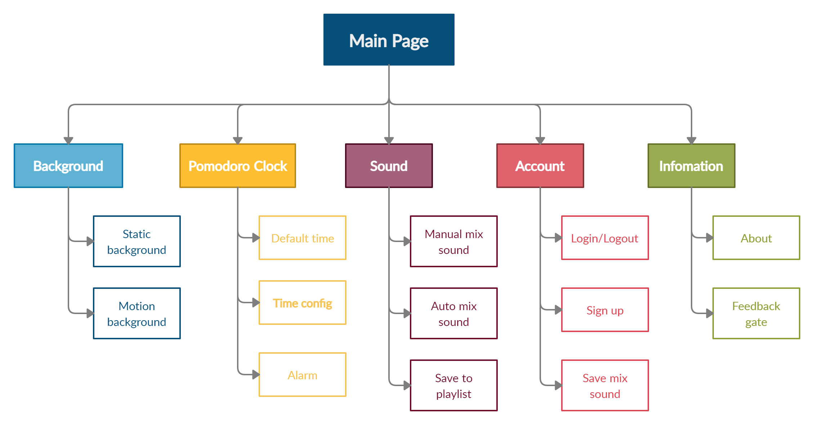

# SOUNDeeD Project
**SOUNDeeD** is a website which is designed to help you relax, focus with your work, study,....

## About SOUNDeeD
There are quite a few sounds for you to choose from: rain, birdsong, wind blowing, and so on. You can mix them together for the best experience. You can mix them together for the best experience. Moreover, when you sign up for an account here, you can keep your own playlists of your favorites because we know it's hard for hard-core people to find a playlist of many sounds mixed with each sound having a different volume is very difficult.

If you need a watch to determine how long you need to focus, then the Podoromo is the best choice for you.  Podoromo is integrated into the website allowing you to customize the countdown interval and notify you if the time is up. Of course, it helps you to manage your time better without having to look at your watch every time you are concentrating on work.

If you are tired of looking at the background of the website, you can choose from different backgrounds from the website, including dynamic or static wallpapers. Don't worry about it, our web-integrated backgrounds have been carefully selected for your comfort.

I hope **SOUNDeeD** is enjoyable and useful for you and we you have a relaxing day! From **nh4ttruong** and **dr00py** with :heart: !

## Functions
SOUNDeeD can do:
- Countdown clock for Podomoro method
- Play chill sounds
- Random mix sound
- Create playlist sound
- Save the playlist to your gallery
- Change static/dynamic background
- Login/Signup function

## Additional
- Subject: Web Application Development
- Contribution: dr00py (Doan Anh Dung)
- Sound resources: All in [freesound](http://www.freesound.org/)
- Images/Videos resources: Adobe Stock, Pexels

Special thanks for all of support for SOUNDeeD!☀️

